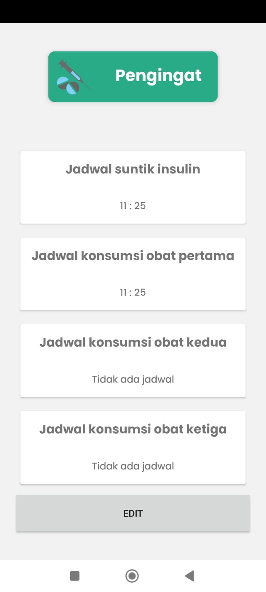
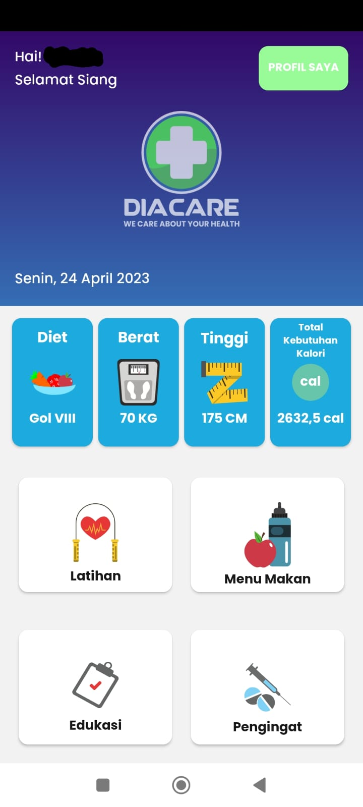
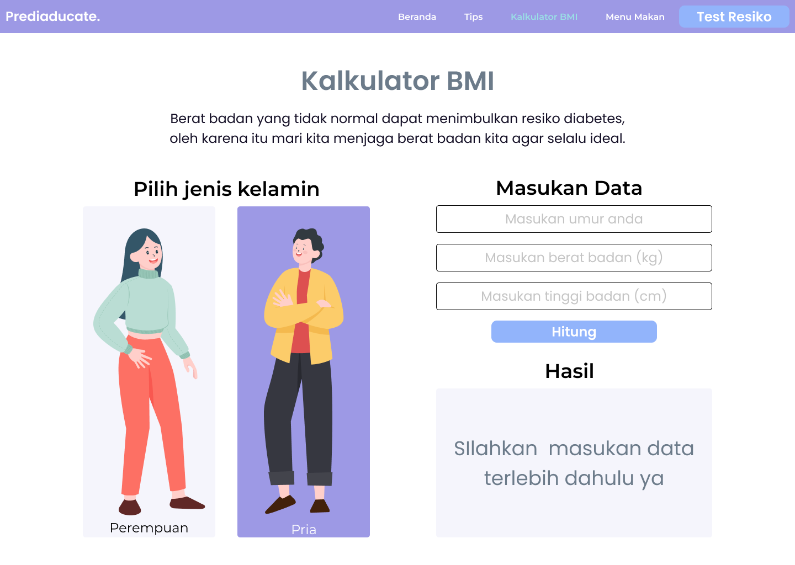
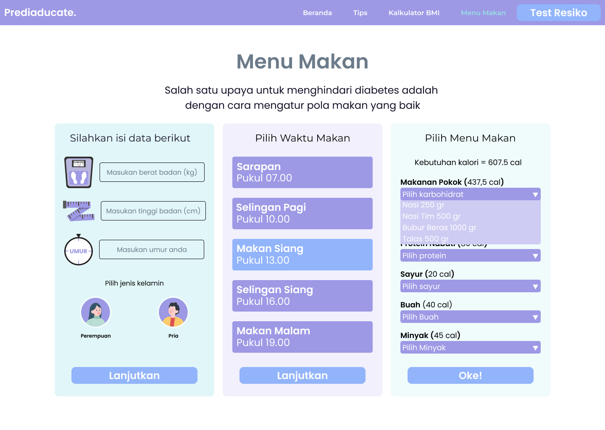
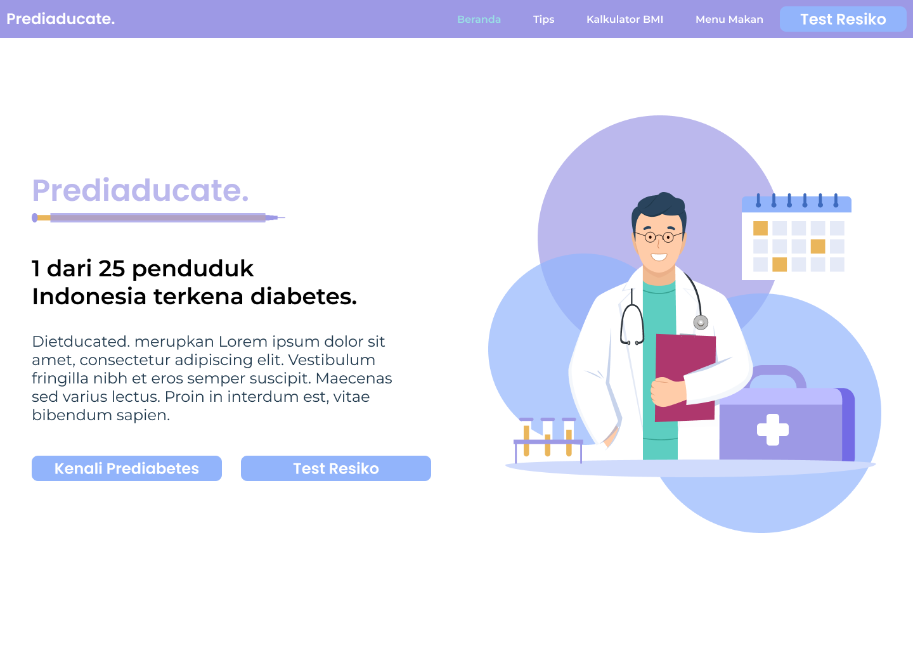
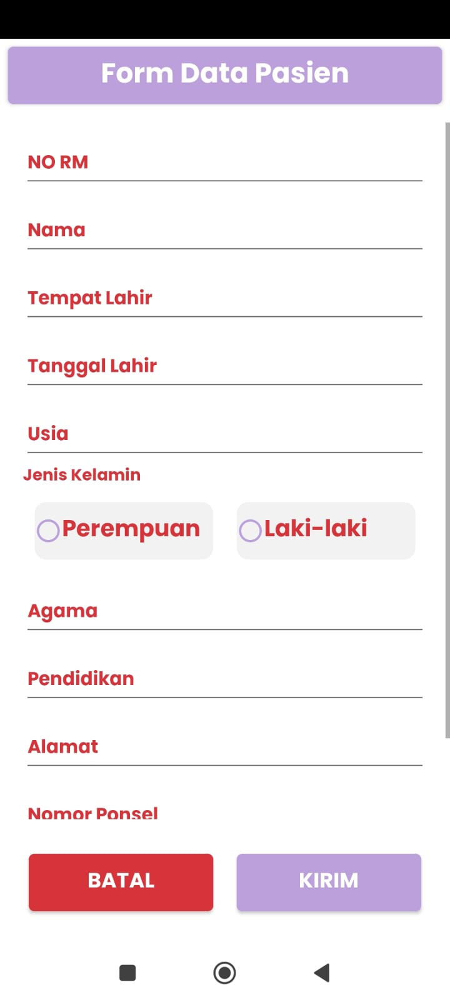
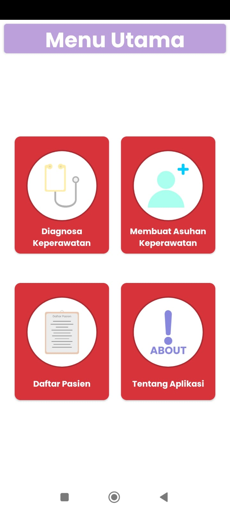
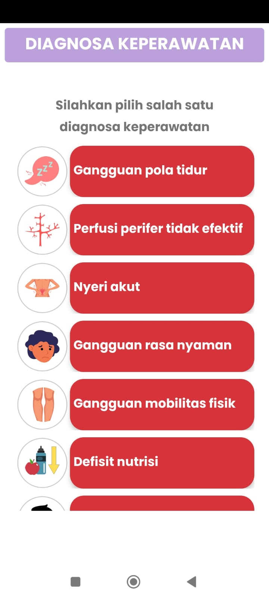

<a name="readme-top"/>

  <h3 align="center">Project Showcase</h3>

  <h4 align="center">
   Introducing my latest project! I am excited to showcase the product of my hard work, creativity, and dedication.
  </h4>

  
Table of Contents

  <ol>
    <li><a href="#diacare">Diacare</a></li>
    <li><a href="#epedial">Epedial</a></li>
    <li><a href="#prediaducate">Prediaducate</a></li>
    <li><a href="#cnn-lstm">Forecasting Stock using CNN-LSTM</a></li>
  </ol>

## Diacare

<a name="diacare" />
Diacare is a React Native app designed to help diabetic patients manage their condition. With Diacare, patients can easily track their blood sugar levels, monitor their medication intake, and keep track of their diet and exercise habits. The app features an intuitive user interface that allows patients to input their data quickly and easily.

One of the key benefits of Diacare is its ability to provide patients with personalized feedback and recommendations based on their data. By analyzing the patient's blood sugar levels and medication usage, the app can provide suggestions for adjusting dosages or changing medications if necessary. The app also includes a comprehensive database of diabetic-friendly recipes, allowing patients to plan their meals and snacks while keeping their blood sugar levels in check.

Diacare is a powerful tool for diabetic patients, allowing them to take control of their condition and make informed decisions about their health. With its user-friendly interface and personalized recommendations, Diacare is an excellent example of how technology can be used to improve patient outcomes and quality of life.

### Feature Sample

#### Alarm

The alarm feature in Diacare is designed to help diabetic patients stay on track with their medication schedule. With this feature, patients can set reminders to take their medication at specific times throughout the day. The app will send a notification to the patient's phone at the designated time, reminding them to take their medication.

This feature is particularly useful for patients who may have a busy schedule or who have trouble remembering to take their medication at the same time every day. By setting reminders in Diacare, patients can ensure that they never miss a dose and stay on track with their treatment plan.

#### Education

The education feature in Diacare is designed to provide diabetic patients with information and resources to help them better understand their condition and how to manage it. This feature includes a variety of educational materials, such as articles, videos, and infographics, that cover topics like diet and exercise, medication management, blood sugar monitoring, and more.

### Screenshot

    <table>
        <tr>
            <td>
                

                    
                     
                    <h4>Alarm Feature</h4>
                

            </td>
            <td>
            

                    
                     
                    <h4>Home Page</h4>
                

            </td>
            <td>
            

                    
                     
                    <h4>Login Page</h4>
                

            </td>
        </tr>
    </table>

(<a href="#readme-top">back to top</a>)

## Prediaducate

<a name="prediaducate"/>

Prediaducate is a React website designed to help users self-diagnose and prevent diabetes. With Prediaducate, users can take a quick quiz to assess their risk for diabetes and receive personalized recommendations for preventing the condition.

The website features an intuitive user interface that allows users to input their data quickly and easily. The quiz is based on a series of questions related to factors like age, weight, exercise habits, and family history of diabetes. Based on the user's responses, the website generates a personalized risk assessment score and provides recommendations for lifestyle changes that can help prevent diabetes.

### Feature Sample

#### Weight Calculator

The weight calculator feature on Prediaducate is designed to help users determine their daily calorie intake based on their weight goals. By inputting their current weight and desired weight, users can calculate the daily caloric intake that is necessary to achieve their weight loss or maintenance goals.

The weight calculator takes into account the user's age, gender, height, and activity level to generate a personalized calorie recommendation. Users can adjust their activity level and weight loss goals to see how it affects their daily caloric intake.

#### Meal Planner

The meal planner feature on Prediaducate is designed to help users plan healthy meals that are tailored to their individual needs and preferences. Users can input their dietary restrictions, food preferences, and calorie goals to generate a personalized meal plan for the week.

The meal planner provides users with a variety of healthy recipes that are low in calories and high in nutrients, making it easy for them to eat well and stay on track with their health goals. Users can customize their meal plans by selecting the recipes they want to use, adjusting portion sizes, and swapping out ingredients to fit their dietary needs.

### Screenshot

    <table>
        <tr>
            <td>
                

                    
                     
                    <h4>Weight Calculator</h4>
                

            </td>
        </tr>
        <tr>
            <td>
                

                    
                     
                    <h4>Home Page</h4>
                

            </td>
        </tr>
        <tr>
            <td>
                

                    
                     
                    <h4>Landing Page</h4>
                

            </td>
        </tr>
    </table>

(<a href="#readme-top">back to top</a>)

## Epedial

<a name="epedial" />

Epedial is an Android app that has been specifically designed to assist nurses in maintaining patient records and diagnosing illnesses in a hospital setting. With its intuitive interface, the app allows nurses to easily input and access patient data in real-time.

Epedial includes a range of useful features that make it easier for nurses to manage patient care. The app allows nurses to track vital signs, medical history, medications, and other relevant patient information, all in one place. This enables nurses to quickly identify any changes or concerns in a patient's condition, and to take appropriate action if needed.

### Feature Sample

#### Input Patient Data

The patient data input feature in Epedial is a key component of the app's ability to help nurses maintain accurate and up-to-date patient records. With this feature, nurses can easily input and update patient data such as medical history, vital signs, medications, allergies, and other important information.

#### Early Diagnose

Early diagnosis is a critical component of effective patient care, and Epedial includes features that help nurses diagnose illnesses more quickly and accurately. The app provides a range of diagnostic options based on a patient's symptoms, medical history, and other relevant data, helping nurses to identify potential issues before they become more serious.

### Screenshot

    <table>
        <tr>
            <td>
                

                    
                     
                    <h4>Patient Form</h4>
                

            </td>
            <td>
            

                    
                     
                    <h4>Home Page</h4>
                

            </td>
            <td>
            

                    
                     
                    <h4>Early Diagnose</h4>
                

            </td>
        </tr>
    </table>

(<a href="#readme-top">back to top</a>)

