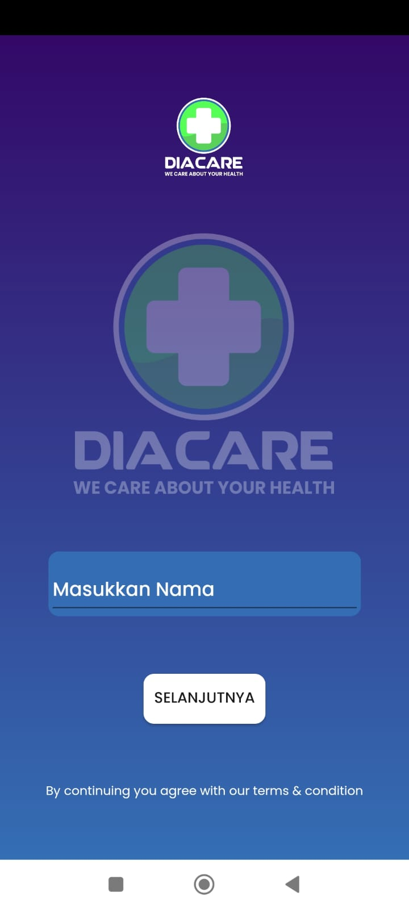

<a name="readme-top"/>

  <h3 align="center">Project Showcase</h3>

  <h4 align="center">
   Introducing my latest project! I am excited to showcase the product of my hard work, creativity, and dedication.
  </h4>

  
Table of Contents

  <ol>
    <li><a href="#diacare">Diacare</a></li>
    <li><a href="#epedial">Epedial</a></li>
    <li><a href="#prediaducate">Prediaducate</a></li>
    <li><a href="#cnn-lstm">Forecasting Stock using CNN-LSTM</a></li>
  </ol>

## Diacare

<a name="diacare" />
Diacare is a React Native app designed to help diabetic patients manage their condition. With Diacare, patients can easily track their blood sugar levels, monitor their medication intake, and keep track of their diet and exercise habits. The app features an intuitive user interface that allows patients to input their data quickly and easily.

One of the key benefits of Diacare is its ability to provide patients with personalized feedback and recommendations based on their data. By analyzing the patient's blood sugar levels and medication usage, the app can provide suggestions for adjusting dosages or changing medications if necessary. The app also includes a comprehensive database of diabetic-friendly recipes, allowing patients to plan their meals and snacks while keeping their blood sugar levels in check.

Diacare is a powerful tool for diabetic patients, allowing them to take control of their condition and make informed decisions about their health. With its user-friendly interface and personalized recommendations, Diacare is an excellent example of how technology can be used to improve patient outcomes and quality of life.

### Sample Feature

#### Alarm

The alarm feature in Diacare is designed to help diabetic patients stay on track with their medication schedule. With this feature, patients can set reminders to take their medication at specific times throughout the day. The app will send a notification to the patient's phone at the designated time, reminding them to take their medication.

This feature is particularly useful for patients who may have a busy schedule or who have trouble remembering to take their medication at the same time every day. By setting reminders in Diacare, patients can ensure that they never miss a dose and stay on track with their treatment plan.

#### Screenshot

    

        
         
        
Alarm Feature

    

    

        
         
        
Home Page

    

    

        
         
        
Login Page

    

